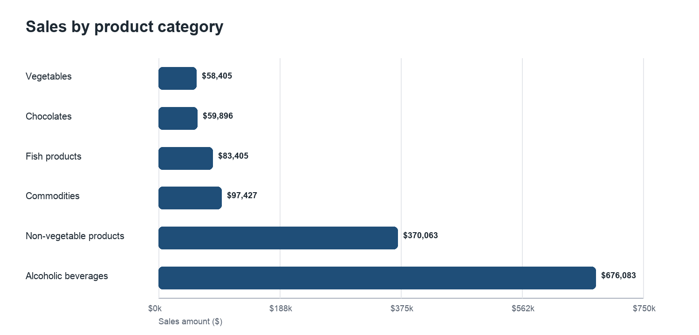
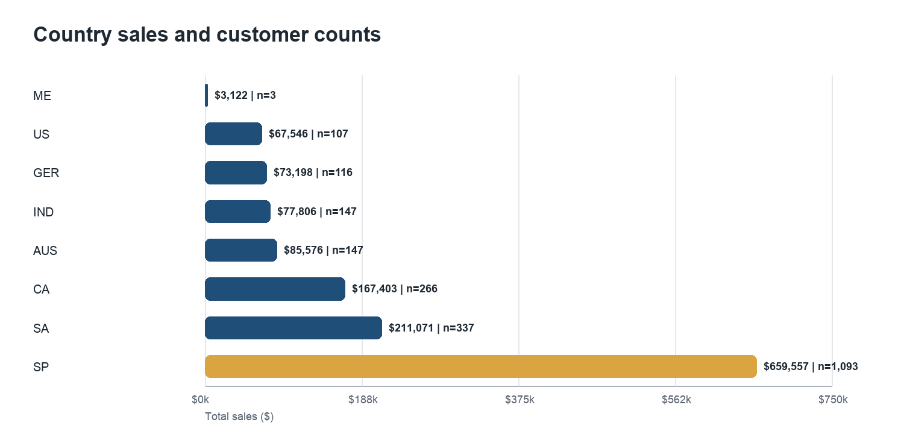
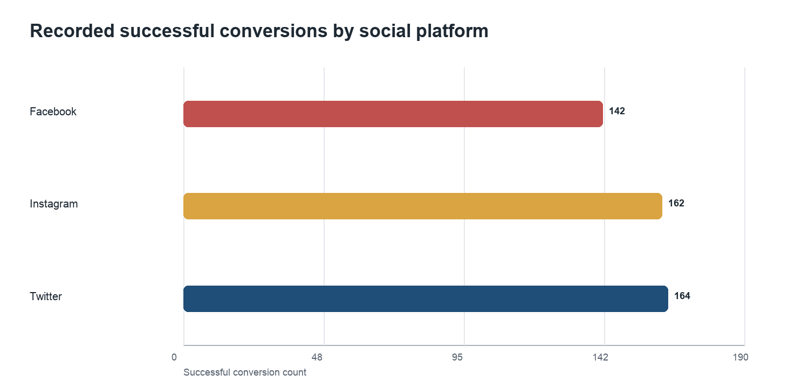
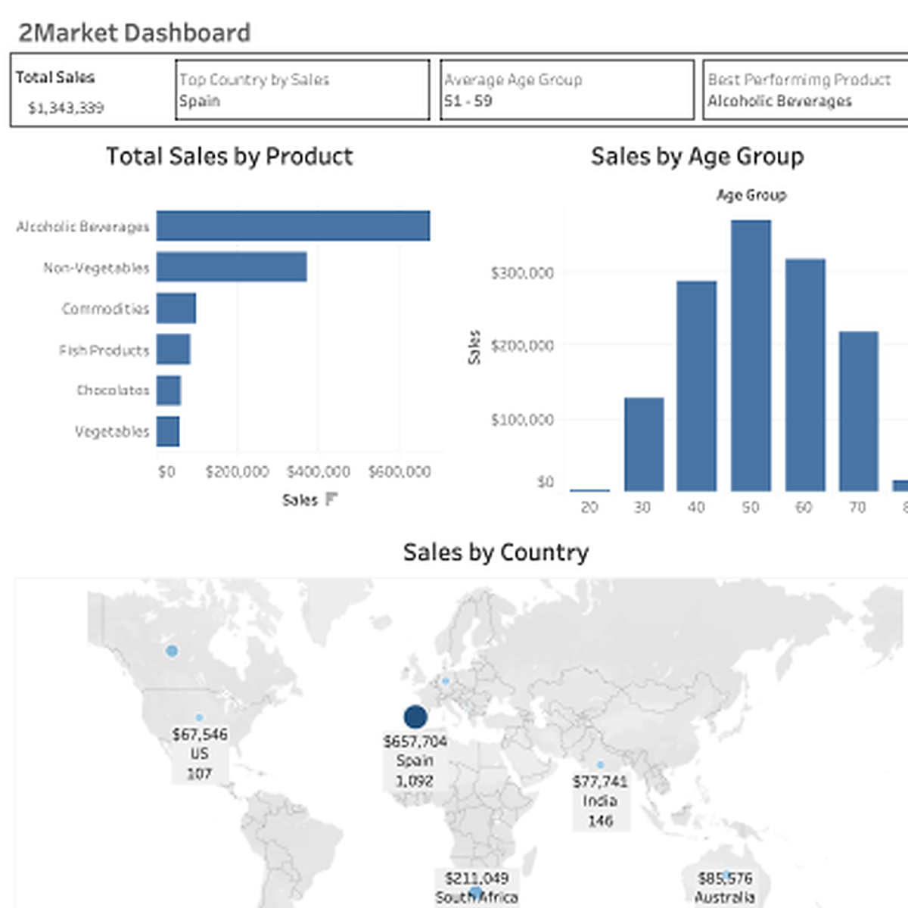

# 2Market Customer and Campaign Analysis

**Author:** Solomon Alfred  
**Tools:** Excel, PostgreSQL, Tableau  
**Focus:** Customer demographics, purchasing behaviour, and successful advertising conversions

## Project overview

2Market is a multinational supermarket seeking a clearer view of its customers, product sales, and advertising conversions. This project analyses 2,216 customer records and connects customer-level purchasing data to advertising conversion indicators.

The portfolio version focuses on three questions:

1. Which customer groups generate the most sales?
2. Which products and countries contribute the most sales?
3. How do recorded successful conversions vary across Twitter, Instagram, and Facebook?

## Headline findings

- The six recorded product categories generated **$1.35 million** in sales.
- Alcoholic beverages contributed **$676,083 (50.3%)**, followed by non-vegetable products at **$370,063 (27.5%)**.
- Spain generated the highest total sales (**$659,557**) and contained 1,093 customers, approximately half of the customer base.
- Spain was not the leader in sales per customer. Country comparisons must therefore separate market size from customer value.
- Twitter recorded 164 successful conversions, Instagram 162, and Facebook 142. The small difference between Twitter and Instagram does not support declaring a decisive overall winner.
- Advertising results varied by country and marital-status segment. Small groups such as Montenegro, `Absurd`, `Alone`, and `YOLO` were not used for firm recommendations.







The polished case-study report is available in [`docs/2market_case_study.pdf`](docs/2market_case_study.pdf).

## Analytical approach

### Excel

Excel was used for the initial review, data-quality checks, customer-age calculations, filtered summaries, and exploratory charts. Age is defined as `2025 - Year_Birth` to make the calculation reproducible. Three implausible birth years (1894, 1900, and 1901) are excluded only from age-based analysis.

### PostgreSQL

PostgreSQL was used to validate table keys, reshape product and platform columns into analysis-friendly rows, aggregate results, and rank categories. The revised scripts avoid interpreting conversion counts as conversion rates or return on investment.

### Tableau

Tableau was used to present product, country, age-group, and advertising-conversion results. The redesign notes in [`tableau/dashboard_spec.md`](tableau/dashboard_spec.md) describe the recommended dashboard structure and corrected calculated fields.

## Original Tableau dashboard

The following dashboard was created in Tableau for the original assignment. The embedded preview was recovered from the packaged workbook because the Tableau product licence is no longer active.



This screenshot demonstrates the original Tableau implementation: KPI tiles, product sales, sales by age group, country mapping, and interactive filtering in the source workbook. It does not incorporate the later portfolio corrections to age calculation, advertising-platform logic, sample-size interpretation, or normalized country comparisons. The proposed corrections are documented in [`tableau/dashboard_spec.md`](tableau/dashboard_spec.md).

## Important interpretation

The advertising table contains binary indicators for successful conversions. It does not contain impressions, clicks, audience exposure, campaign cost, or timestamps. Consequently:

- the analysis reports **successful conversion counts**;
- it does not calculate conversion rate, cost per acquisition, return on ad spend, or incrementality;
- it does not prove that an advertisement caused a customer's total product spending;
- customers may have successful conversions recorded for more than one channel.

## Repository structure

```text
2market-portfolio/
├── README.md
├── data/
│   └── README.md
├── docs/
│   ├── methodology.md
│   └── 2market_case_study.pdf
├── images/
│   ├── product_sales.png
│   ├── country_sales.png
│   └── social_conversions.png
├── sql/
│   ├── 01_schema.sql
│   ├── 02_quality_checks.sql
│   └── 03_analysis.sql
└── tableau/
    └── dashboard_spec.md
```

## Data availability

The original course dataset and Tableau packaged workbook are not included because the author does not hold redistribution rights. The metadata and expected field structure are documented in [`data/README.md`](data/README.md), allowing the workflow to be reviewed without exposing restricted records.

## Limitations

- Product fields represent spending amounts, but no product-cost data is available; findings concern sales, not profit.
- Advertising exposure, spend, impressions, clicks, and campaign dates are unavailable.
- Product spending is stored at customer level without transaction timestamps, preventing seasonality and trend analysis.
- Country totals are affected by unequal customer counts.
- Very small customer segments are descriptive only and should not guide investment decisions.
- Age depends on the chosen reference year and is not the customer's age at a specific purchase.

## Recommended next steps

1. Add transaction dates, quantities, product costs, and margins.
2. Add campaign exposure, spend, impression, and click data.
3. Use controlled experiments or a documented attribution model before reallocating advertising budgets.
4. Compare countries using both totals and normalized measures such as sales per customer.
5. Investigate customer value using recency, frequency, and monetary segmentation.
